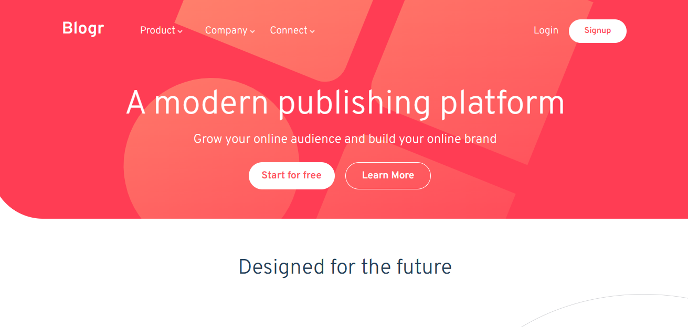

# Frontend Mentor - Blogr landing page solution

This is a solution to the [Blogr landing page challenge on Frontend Mentor](https://www.frontendmentor.io/challenges/blogr-landing-page-EX2RLAApP). Frontend Mentor challenges help you improve your coding skills by building realistic projects. 

### The challenge

Users should be able to:

- View the optimal layout for the site depending on their device's screen size
- See hover states for all interactive elements on the page

### Screenshot

### Links

- Solution URL: [Add solution URL here](https://etimexo.github.io/Blogr-page/)
- Live Site URL: [Add live site URL here](https://etimexo.github.io/Blogr-page/)

## My process

### Built with

- Semantic HTML5 markup
- CSS custom properties
- Flexbox
- Mobile-first workflow
- [React](https://reactjs.org/) - JS library

If you want more help with writing markdown, we'd recommend checking out [The Markdown Guide](https://www.markdownguide.org/) to learn more.

### Continued development

I plan on learning to work with React more in the future.

### Useful resources

## Author

- Website - [Add your name here](https://gentledove.netlify.app)
- Frontend Mentor - [@yourusername](https://www.frontendmentor.io/profile/etimexo)
- Twitter - [@yourusername](https://www.twitter.com/theGentleDove)

## Acknowledgments

Shout out to the owner of "Code With Ajesh" Youtube Channel. 
His video helped me when I was struggling with deploying the app.